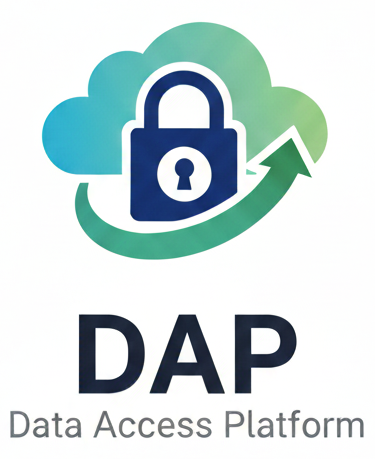
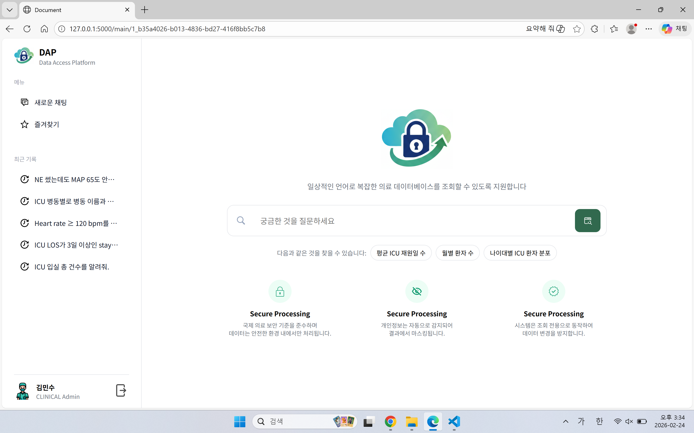
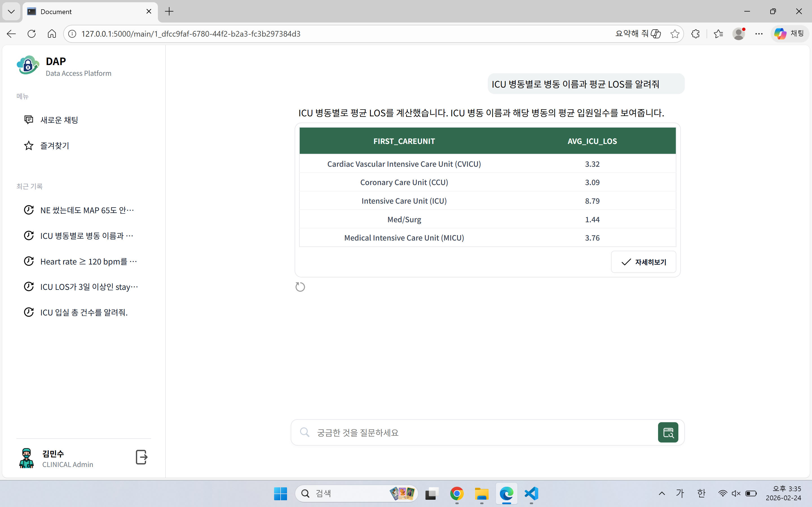
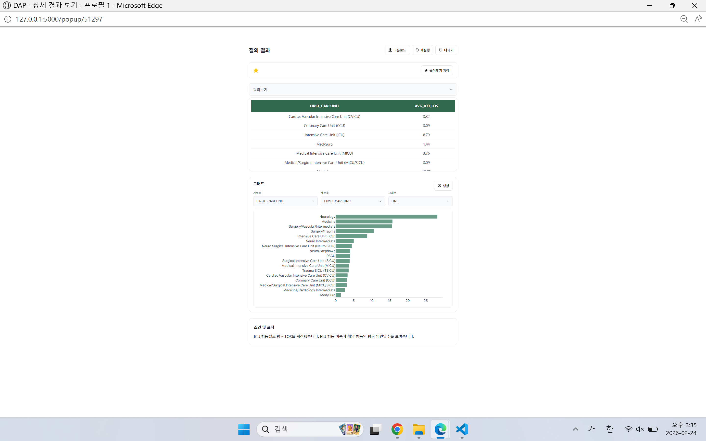
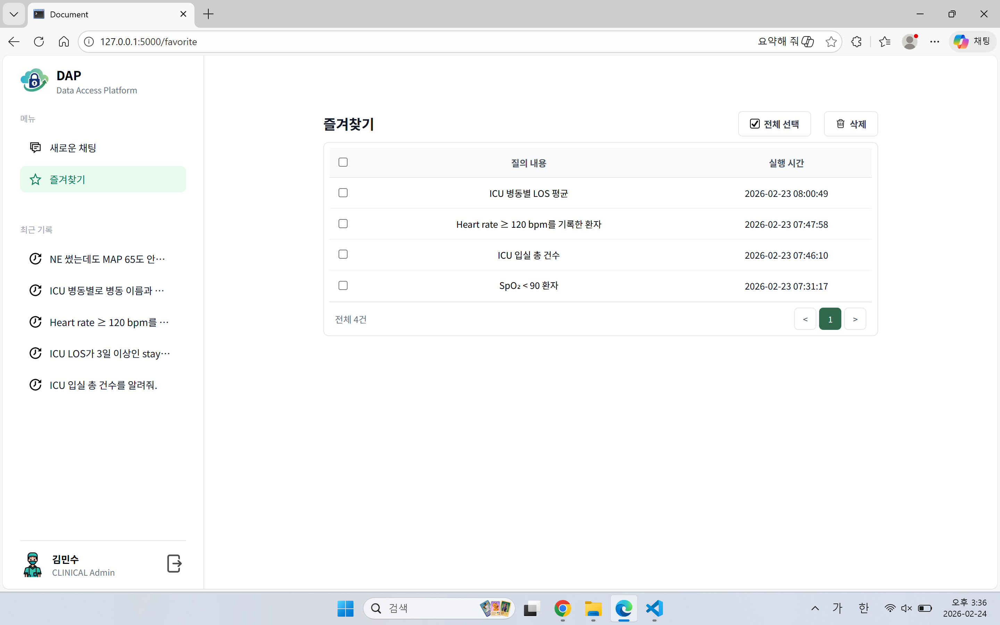
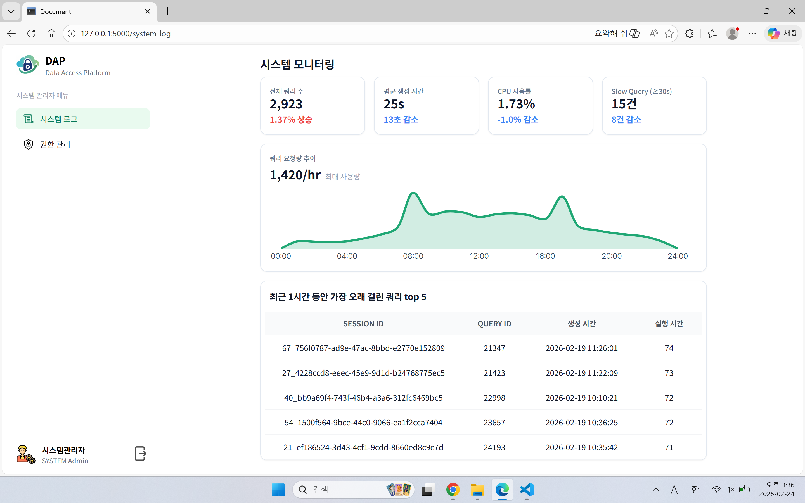
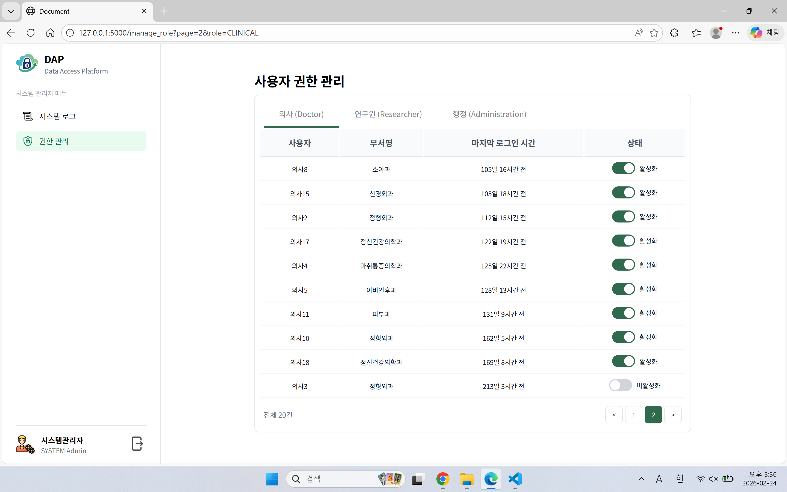

# DAP (Data Access Platform) — Backend



의료 도메인 사용자(의료진/연구자/행정/시스템)가 **자연어(한국어)로 질문하면, Oracle 의료 DB(MIMIC 기반)를 “조회 전용”으로 안전하게 조회**할 수 있도록 돕는 데이터 접근 플랫폼입니다.  
본 저장소는 서비스의 **백엔드(Flask) + UI 템플릿 + LLM→SQL 파이프라인**을 포함합니다.

---

## 1) 서비스 한 줄 정의

“SQL을 몰라도, 권한 범위 안에서, 안전하게 의료 데이터를 조회하고 결과를 즉시 활용(미리보기/상세/그래프/CSV)할 수 있는 질문형 데이터 접근 서비스”

---

## 1.1) 적요(Executive Summary)

- 의료진/연구자/행정이 **자연어 질문**만으로 의료 DB를 조회할 수 있도록 지원
- 역할 기반(RBAC)으로 **조회 가능한 테이블을 자동 검증**해 권한 밖 접근을 차단
- 결과를 채팅에서 **미리보기**하고, 상세 팝업에서 **쿼리/설명/그래프/CSV**까지 한 번에 제공
- 개인정보/식별자 컬럼은 **부분 마스킹**으로 노출 위험을 낮춤
- 운영/관리자는 **시스템 모니터링(쿼리/Slow/CPU)** 및 **사용자 권한 관리** 화면 제공

---

## 2) 해결하려는 문제(Problem)

- 의료 데이터는 **스키마/조인/권한**이 복잡해 “질문은 있는데 SQL이 없는” 상황이 반복됩니다.
- 조직/역할에 따라 접근 가능한 테이블이 다르며, 실수로 **권한 밖 데이터**를 조회하거나 **식별자 노출** 위험이 있습니다.
- 같은 질문을 재현하거나 공유하기 어렵고, 결과를 CSV/그래프로 내보내는 업무가 번거롭습니다.

---

## 3) 목표 사용자와 역할(Role)

서비스는 로그인 계정의 역할에 따라 데이터 접근 범위가 달라집니다.

- `CLINICAL` (의료진): 진료/중환자실 중심의 폭넓은 조회
- `RESEARCHER` (연구자): 연구 목적 조회(예: 환자 식별 테이블 일부 제한 가능)
- `ADMINISTRATION` (행정): 제한된 테이블 중심의 운영/행정 조회
- `SYSTEM` (시스템 관리자): 서비스 모니터링/권한 관리

> 구현은 `app.py`의 역할별 Oracle 계정 풀 분리 + `func.py`의 테이블 권한 검증 로직으로 구성됩니다.

---

## 4) 핵심 사용자 경험(UX) — 화면 흐름

1. 로그인: `/` → `templates/login.html`
2. 질문 입력: `/main/<chat_session_id>` → `templates/main.html`
3. “생성 중” 상태 표시(비동기) + 자동 갱신: `/check_answer_status/<answer_id>`
4. 결과 미리보기(최근 답변 일부를 테이블로 표시)
5. 상세 팝업: `/popup/<answer_id>` → `templates/popup.html`
   - 쿼리 보기 / 결과 테이블 / “조건 및 로직(설명)” / 그래프 생성
6. CSV 다운로드: `/popup/<answer_id>/download` (최대 100,000행)
7. 즐겨찾기: `/favorite` (저장/목록/일괄 삭제)
8. 관리자:
   - 시스템 로그: `/system_log`
   - 권한 관리: `/manage_role`

---

## 4.1) 화면 스크린샷

스크린샷은 `docs/screenshots/`에 저장되어 있으며, 아래에서 주요 화면 흐름을 확인할 수 있습니다.

### 홈(초기) 화면



### 채팅 + 결과 미리보기



### 상세 결과(쿼리/그래프/조건 및 로직)



### 즐겨찾기



### 시스템 모니터링(관리자)



### 사용자 권한 관리(관리자)



---

## 5) 주요 기능(What)

### 5.1 자연어 → SQL → 결과

- 한국어 질문을 의료 문맥에 맞게 정규화/번역한 뒤 Oracle SQL을 생성합니다.
- 생성된 SQL은 검증을 거쳐 결과를 표 형태로 제공합니다.

### 5.2 비동기 생성 + 폴링

- 답변 생성은 백그라운드에서 수행하고, UI는 폴링으로 완료 시 자동 갱신합니다.
- 사용자에게 “기다리는 경험”을 명확히 제공하고, 실패 시 안내 메시지를 반환합니다.

### 5.3 상세보기에서 “설명 + 시각화 + 다운로드”

- 상세 팝업에서 SQL 포맷과 결과를 보여주고, 그래프를 즉석 생성(Plotly)합니다.
- 결과를 CSV로 다운로드합니다(기본 최대 100,000행 제한).

### 5.4 즐겨찾기

- 생성된 질의를 타이틀로 저장하고, 목록에서 일괄 선택/삭제할 수 있습니다.

### 5.5 시스템 관리자 기능

- 쿼리 통계/평균 생성 시간/Slow Query/CPU 지표를 대시보드로 제공합니다.
- 사용자 권한(활성/비활성 등) 관리 UI를 제공합니다.

---

## 6) 서비스 정책 & 가드레일(How we keep it safe)

### 6.1 조회 전용(의도) 정책

- SQL 생성 파이프라인에서 `INSERT/UPDATE/DELETE/DROP/...` 등 금지 키워드를 차단합니다(`llm.py`의 `SQLValidator`).
- CSV 다운로드는 `SELECT`만 허용합니다(`func.py`의 `select_to_csv_bytes_pandas`).

### 6.2 권한 검증(RBAC + 테이블 단위 차단)

- 역할별로 DB 계정 풀을 분리합니다(`app.py`).
- 생성 SQL에서 참조 테이블을 추출(`func.py`의 `extract_tables`)하고,
  해당 유저가 접근 가능한 테이블 목록(`func.py`의 `privilege_validation`, `DBA_TAB_PRIVS`)에 없으면 즉시 차단합니다.

### 6.3 개인정보/식별자 마스킹

- 결과에서 `SUBJECT_ID`, `HADM_ID`, `STAY_ID` 등 민감 컬럼을 부분 마스킹합니다(`llm.py`의 `auto_mask_mimic_partial`).

### 6.4 재현 가능성(바인드 저장)

- 리터럴을 바인드 변수로 변환해 저장하여, 동일한 질의 재실행/관리/감사가 가능하도록 설계했습니다(`llm.py`의 `change_bind_query`).

---

## 7) 운영 관점 지표(What to measure)

서비스/운영 개선을 위해 다음 지표를 모니터링 대상으로 둡니다.

- 질문 수(시간 단위), 평균 생성 시간, Slow Query(예: 30초 이상), CPU 사용량
- 즐겨찾기 사용률, 다운로드 사용률, 상세보기 전환율
- 에러율(LLM 생성 실패/DB 실행 실패/권한 차단 등) 및 원인 분류

> 참고: 시간별 집계/정리 작업은 `dba_work/SQL_db스케줄러.sql`에 예시가 있습니다.

---

## 8) 산출물/리소스(Deliverables)

- ERD: `dba_work/ERD1차.png`, `dba_work/MIMIC ERD 최종.pdf`
- DBA 스크립트:
  - 역할/유저/권한: `dba_work/SQL_유저별 권한 설정.sql`
  - 스케줄러/통계: `dba_work/SQL_db스케줄러.sql`
- LLM/RAG 리소스:
  - 테이블/컬럼/SQL 가이드/약어 사전: `for_llm/`
  - ChromaDB persistent data: `for_llm/table_info/`, `for_llm/concept_store/`, `for_llm/syntax_info/`
  - 생성 노트북: `for_llm/chroma_db생성_*.ipynb`
- 의료 용어/코드 매핑 리소스: `mimic_medical_word_json/`
- 성능 분석/평가: `llm성능평가.ipynb`, `dba_work/*.ipynb`

---

## 9) 범위(Out of scope)

- 임상적 해석/진단/치료 권고(의사결정 지원이 아닌, “데이터 조회/요약” 목적)
- 데이터 수정/삭제(조회 전용 정책)
- 외부 공유/퍼블릭 API(현재는 내부 서비스 가정)

---

## 10) 개발/운영 가이드(부록) — 빠른 실행

### 10.1 전제

- Python 3.10+ 권장
- Oracle Instant Client(Thick mode) 설치 필요
- Ollama 설치 및 LLM 모델 준비 필요(예: `ollama pull qwen2.5:7b`)

### 10.2 의존성 설치

> 참고: `requirements.txt`는 **UTF-16 LE(BOM)** 입니다. 일부 환경에서 `pip install -r requirements.txt`가 실패할 수 있어 UTF-8로 변환 후 설치를 권장합니다.

```bash
python3 -m venv .venv
source .venv/bin/activate

python3 - <<'PY'
from pathlib import Path
p = Path("requirements.txt")
txt = p.read_text(encoding="utf-16")
Path("requirements.utf8.txt").write_text(txt, encoding="utf-8")
print("wrote requirements.utf8.txt")
PY

pip install -r requirements.utf8.txt
```

### 10.3 환경 변수(.env)

```dotenv
ORACLE_DSN=host:port/service_name
user=...
password=...
```

### 10.4 필수 경로 설정(Instant Client / RAG 리소스)

현재 코드는 Windows 경로를 하드코딩합니다.

- `app.py`: `oracledb.init_oracle_client(lib_dir=...)`
- `llm.py`: `Config.ORACLE_CLIENT_PATH`, `CHROMA_DB_FOLDER`, `Config.ABBR_DICT_PATH`

로컬 실행 시 저장소 구조에 맞춰 예를 들어 다음처럼 상대경로로 맞추는 것을 권장합니다.

```python
# llm.py
CHROMA_DB_FOLDER = r"./for_llm"
Config.ABBR_DICT_PATH = r"./for_llm/mimic_iv_abbreviation_160.json"
```

> 주의: `llm.py`는 import 시점에 `setup.initialize()`를 실행합니다. 경로/리소스가 맞지 않으면 앱 시작 단계에서 실패할 수 있습니다.

### 10.5 실행

```bash
python3 app.py
```

브라우저에서 `http://127.0.0.1:5000/` 로 접속합니다.

---

## 11) 보안/운영 주의사항(필독)

- 현재 코드에는 실행 편의를 위한 값이 포함되어 있습니다(예: `app.py`의 `app.secret_key`, Oracle 계정/비밀번호 하드코딩).  
  외부 공개/실서비스 배포 전 반드시 제거하고 Secret 관리로 전환하세요.
- 운영 환경에서는 아래 항목을 필수 체크리스트로 권장합니다.
  - DB 권한 최소화(스키마/테이블 단위), 네트워크 접근 통제
  - 감사 로깅(사용자/질의 단위), 모니터링/알림
  - LLM 출력 검증 강화(예: SQL AST 기반 allowlist), 프롬프트 관리/버전닝
